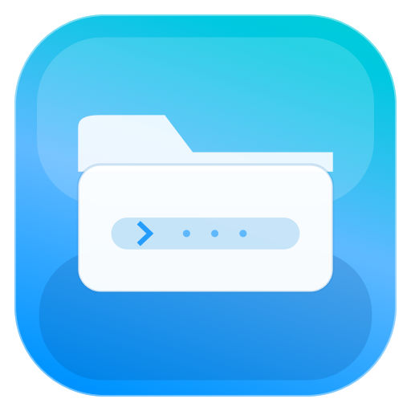

# FinderPath

**See and copy your current Finder folder path from the macOS menu bar. A separate Linux sibling is available at [finderpath-linux](https://github.com/bhino50/finderpath-linux).**

   

---

## What it does

FinderPath sits in your menu bar and shows the POSIX path of the frontmost Finder window. Click the icon to copy the path, open the folder in cmux, Ghostty, or Terminal, launch a CLI agent (Codex, Claude, Hermes) right there, or pop open a clean **Connect to Server** window to SSH into your machines — including your Tailscale devices — no more hunting through Finder or typing paths by hand.

For Linux desktops, use the separate [finderpath-linux](https://github.com/bhino50/finderpath-linux) sibling. Its one-file installer provides copy path, copy `cd`, terminal/Ghostty/cmux launchers, Codex/Claude/Hermes launchers, SSH, Tailscale parsing, file-manager hooks, dependency bootstrap, and an optional tray app.

---

## Features

- **Menu bar path display** — always-visible path header at the top of the menu
- **Copy Path** — copies the full POSIX path to the clipboard
- **Copy cd Command** — copies a shell-safe `cd "/path/to/folder"` command, ready to paste
- **Open in cmux / Ghostty** — your primary launchers, at the top of the menu; open the current Finder folder in cmux or a new Ghostty window
- **Open in Terminal** — opens Terminal.app in the current Finder folder
- **Open with Codex / Claude / Hermes** — launches optional CLI agents in a new Terminal session at the current folder
- **Connect to Server** — a clean window (modeled on macOS Terminal's New Remote Connection) for SSH-ing to your machines. Lists your **Tailscale** devices live — Linux-only by default with a "Show all" toggle — shows VPN status with a Connect/Disconnect button, and keeps a curated list of your own servers you manage with +/−. Runs the session in Ghostty or Terminal.
- **Shortcut action URLs** — `finderpath://open-ghostty`, `finderpath://open-cmux`, and `finderpath://connect` trigger those actions from keyboard tools like Karabiner
- **Check for Updates** — pulls the latest GitHub Release and offers a one-click download if a newer version is available
- **Configurable Settings** — toggle menu items; choose path display style (full, `~`-abbreviated, compact); adjust header width, font size, and truncation mode; pick menu bar icon and optional short title; set `cd` quoting style; choose the SSH terminal; configure agent executable paths and the update source URL

---

## Screenshot



---

## Quick Start

### Download (recommended)

Download the latest `.dmg` or `.zip` from [Releases](https://github.com/bhino50/finder-path/releases), open it, move `FinderPath.app` to `/Applications`, and launch it. The app is menu bar-only — no Dock icon will appear.

### First launch (Gatekeeper)

FinderPath is open source and **ad-hoc signed, not Apple-notarized** — notarization requires a paid Apple Developer ID, which this project doesn't have. Because of that, macOS Gatekeeper blocks the app the first time you open it, with a message like *"FinderPath can't be opened because Apple cannot check it for malicious software."* This is expected for an unnotarized open-source app, not a sign that anything is wrong. Here's how to open it (you only need to do this once):

- **macOS 13–14 (Ventura / Sonoma):** right-click (or Control-click) `FinderPath.app` → **Open**, then click **Open** in the dialog.
- **macOS 15+ (Sequoia):** double-click `FinderPath.app` once (it gets blocked), then open **System Settings → Privacy & Security**, scroll to the *"FinderPath was blocked…"* message, click **Open Anyway**, and confirm with **Open**.

Prefer not to bypass Gatekeeper? Build it yourself from source (below) — a local build launches with no warning. The source is a single Swift file you can read end to end.

### Build from Source

Requirements: macOS 13+, Xcode with Swift 5.9+ (or just the Command Line Tools for the no-Xcode script below)

```bash
git clone https://github.com/bhino50/finder-path.git
cd finder-path
open FinderPath.xcodeproj   # then press Run in Xcode
```

Or build and launch from the terminal:

```bash
./script/build_and_run.sh
```

No Xcode IDE? Build and run with only the Command Line Tools (`xcode-select --install`) — no `.xcodeproj`, no `xcodebuild`. This compiles the single Swift source with `swiftc` and assembles the `.app` by hand:

```bash
./script/run_no_xcode.sh          # build + launch
./script/run_no_xcode.sh build    # build only
```

### Linux sibling

Download and run the one-file Linux installer:

```bash
curl -fL -o finderpath-linux-installer.sh \
  https://github.com/bhino50/finderpath-linux/releases/latest/download/finderpath-linux-installer.sh
chmod +x finderpath-linux-installer.sh
./finderpath-linux-installer.sh --yes
```

See [bhino50/finderpath-linux](https://github.com/bhino50/finderpath-linux) for Linux-specific source install notes, file-manager integrations, and validation commands.

---

## Settings

Open Settings from the menu (or press `,` while the menu is open) to configure:

| Section | Options |
|---------|---------|
| Menu Items | Toggle visibility of each menu action |
| Path Header | Header title, display style, truncation, width, font size |
| Menu Bar Icon | SF Symbol choice, optional short title |
| Terminal | `cd` quoting style (double or single quotes) |
| Remote Connections | SSH terminal (Ghostty or macOS Terminal); servers and Tailscale devices are managed in the Connect to Server window |
| Agent Launchers | Codex, Claude, and Hermes executable paths, hide-if-unavailable toggle |
| Updates | Installed version, update manifest URL (GitHub Releases by default), manual Check Now |

---

## Permissions

FinderPath requires two Automation permissions, granted via a macOS prompt on first use:

- **Finder** — reads the path of the frontmost Finder window via AppleScript
- **Terminal / Ghostty** — opens terminal sessions for the terminal and agent launch actions

To review or re-grant permissions: System Settings > Privacy & Security > Automation > FinderPath.

If access is denied, FinderPath shows the AppleScript error in the path field instead of crashing.

---

## Updates

`Check for Updates...` reads the latest GitHub Release from `https://api.github.com/repos/bhino50/finder-path/releases/latest`, strips the leading `v` from the tag (`v1.2` → `1.2`), and compares it to the installed `CFBundleShortVersionString`. If a newer release is found, FinderPath shows an alert with the release notes and a `Download` button that opens the first `.dmg` asset (falling back to the first `.zip`, or the release page) in your browser. The source URL is editable under Settings > Updates.

The parser also accepts a plain JSON manifest if you point the URL elsewhere:

```json
{
  "version": "1.2",
  "downloadURL": "https://example.com/FinderPath-1.2.dmg",
  "notes": "Release notes."
}
```

To ship a new version:

1. Bump `MARKETING_VERSION` and `CURRENT_PROJECT_VERSION` in the Xcode project, plus `VERSION` in `script/package_release.sh`.
2. `./script/package_release.sh` (set `DEVELOPER_ID` + `NOTARY_PROFILE` for a notarized DMG).
3. Tag the commit and publish a GitHub Release with the `.dmg` attached:

   ```bash
   gh release create v1.2 dist/FinderPath-1.2.dmg \
     --title "1.2" --notes "Release notes for this version."
   ```

   Existing installs hit `Check for Updates...` and get the new DMG.

---

## Building and Packaging

```bash
# Debug build + run
./script/build_and_run.sh

# Local-test DMG (unsigned, for personal use)
./script/package_release.sh

# Signed + notarized release (requires Apple Developer account)
DEVELOPER_ID="Developer ID Application: Your Name (TEAMID)" \
NOTARY_PROFILE="FinderPathNotary" \
./script/package_release.sh
```

See the `script/` folder for full details. For Developer ID signing and notarization setup, store your credentials once with `xcrun notarytool store-credentials` before running the release script.

---

## Contributing

See [CONTRIBUTING.md](CONTRIBUTING.md). Bug reports and pull requests are welcome.

---

## License

MIT — see [LICENSE](LICENSE).
